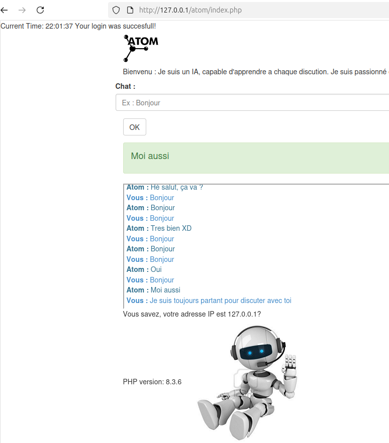

# ChatATOM
Projet ChatATOM in PHP 8.3.6

## Prevu
index.php
<div style="display: flex; justify-content: center; align-items: center; gap: 1em; margin: 0 0 2em 0;">
  
</div>


## Install
```bash
sudo apt install composer

## Linux note:
```bash
sudo chown -R root:www-data /var/www

Next, set the appropriate permissions to allow group members to write to these directories:
```bash
sudo chmod -R 775 /var/www

## Contact & info

